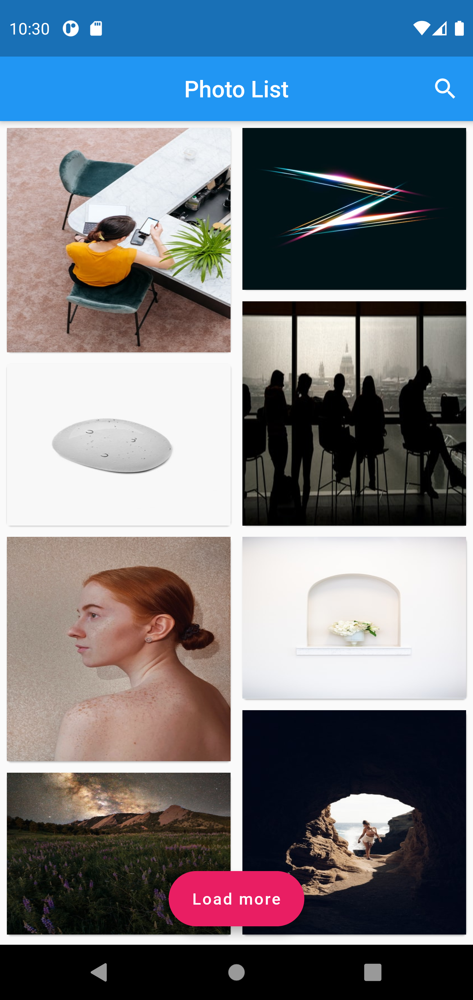
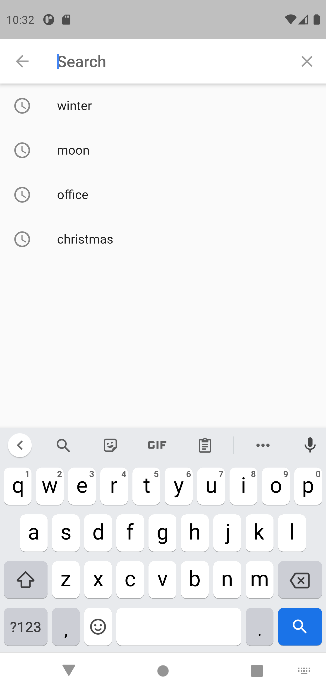
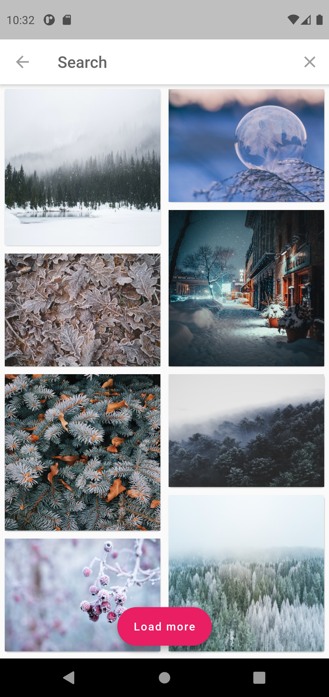
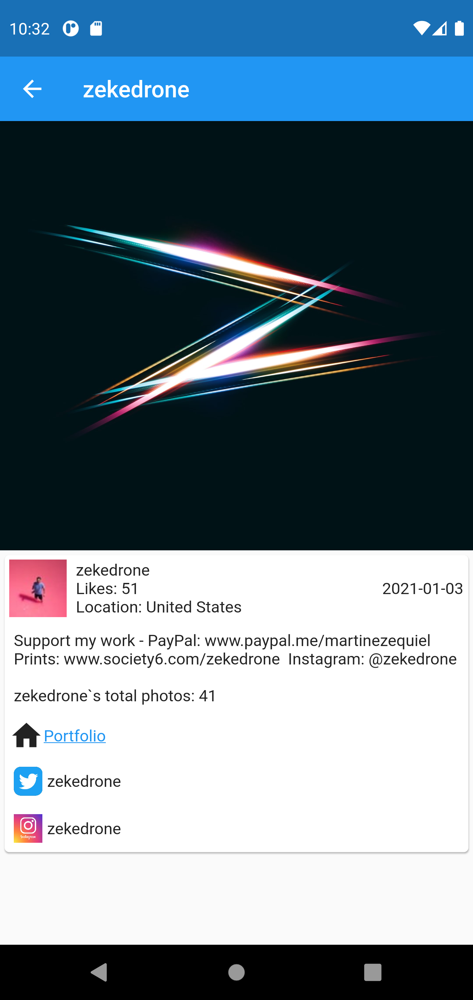

# photo_list_redux

Photo list created with redux state management and unsplash API.

## Features

1. Button to load more photos
2. Search photo by name
3. Search history
4. Autocomplete suggestions
5. Photo details with useful links


## Screenshots
## Screenshots


<p>




</p>

## Getting Started
#### 1. [Setup Flutter](https://flutter.io/setup/)
#### 2. Clone the repo
```sh
$ git clone https://github.com/Zubii12/photo_list_redux
$ cd photo_list_redux/
```
#### 3. Before using the Unsplash API, [register as a developer](https://unsplash.com/developers).
#### 4. Before using the Unsplash API, read the [API Guidelines](https://help.unsplash.com/api-guidelines/unsplash-api-guidelines).
#### 5. Set your key after you register as a developer:
- Open `src/data/unsplash_api ` then set your `key` at line `13`.

## Questions?🤔
Hit me on

<a href="https://www.linkedin.com/in/zubii12/"></a>
## Other resources

A few resources to get you started if this is your first Flutter project:

- [Lab: Write your first Flutter app](https://flutter.dev/docs/get-started/codelab)
- [Cookbook: Useful Flutter samples](https://flutter.dev/docs/cookbook)

For help getting started with Flutter, view our
[online documentation](https://flutter.dev/docs), which offers tutorials,
samples, guidance on mobile development, and a full API reference.
